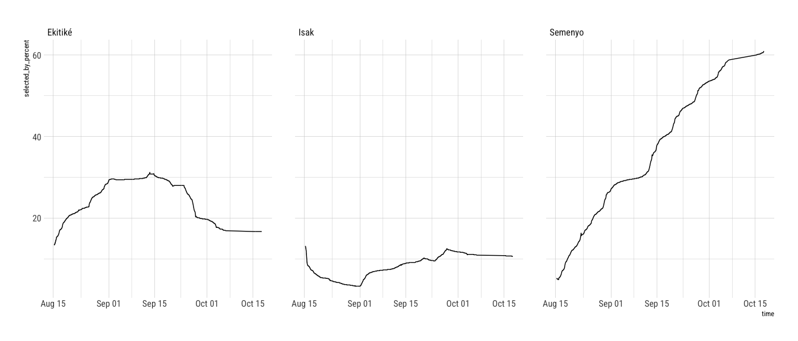

# FPL data for season 2025-26

## About

2025-10-12: Updated player data. Data break from October 5 to October
12, as server crashed.

2025-09-12: Updated player data and GW player (including GW3)

2025-09-07: Updated player data and GW player

2025-08-27: Updated player data

2025-08-22: Here I share data on the FPL 2025/26 season. So far I have
not found a solution to get data on all 10 000 000 players. Instead I am
collecting data on 100 000 randomly selected players. Please let me know
if you find mistakes or something is missing.

## Datasets

1.  fplplayer_ids.csv

    - content: list of fpl player included in the sample
    - generated by: data_get_fplplayer_ids.R

2.  fpl_teams_gwX.parquet

    - content: team selections by gameweek
    - generated by: data_get_fpl_teams.R
    - X is a placeholder for the GW

3.  fplplayer_entry_season.parquet

    - content: points (and points on bench) and rank by gameweek
    - generated by: data_get_fplplayer_info.R

4.  fplplayer_favourite_teams.parquet

    - content: favourite teams (numeric code)
    - generated by: data_get_fplplayer_info.R

5.  fplplayer_history.parquet

    - content: past performance
    - generated by: data_get_fplplayer_info.R

6.  fplplayer_mini_leauges.parquet

    - content: mini leagues
    - generated by: data_get_fplplayer_info.R

7.  players.parquet

    - content: Premier League player prices, popularity, performance
    - generated by: data_get_players.R and data_join_players.R

## Examples

### Ownership

``` r
# Libraries
library("ggplot2")

# Load data 
df_players<-arrow::read_parquet("/Users/hhs/Dropbox/Bucket/fpl2526/data/players.parquet")

# Create chart
ggplot(df_players[df_players$web_name%in%c("Semenyo","Ekitiké","Isak"),],  
      aes(x=time,y=selected_by_percent))+
    facet_wrap(~web_name)+
    geom_line()+
   tinythemes::theme_ipsum_rc()
```



### FPL player with id 6708968

#### League history

``` r
# Load data 
df_history<-arrow::read_parquet("/Users/hhs/Dropbox/Bucket/fpl2526/data/fplplayer_history.parquet")

# Check data
df_history[df_history$fplid==6708968,]
```

    # A tibble: 4 × 4
        fplid season_name total_points    rank
        <int> <chr>              <int>   <int>
    1 6708968 2020/21             1770 4747456
    2 6708968 2021/22             2084 2057795
    3 6708968 2022/23             2155 3274063
    4 6708968 2024/25             2180 3147697

#### Mini leagues

``` r
# Load data 
df_leagues<-arrow::read_parquet("/Users/hhs/Dropbox/Bucket/fpl2526/data/fplplayer_leagues.parquet")

# Check data
df_leagues[df_leagues$fplid==6708968,]
```

    # A tibble: 8 × 3
        fplid leaguename        leagueid
        <int> <chr>                <int>
    1 6708968 Wolves                  20
    2 6708968 England                261
    3 6708968 Gameweek 1             276
    4 6708968 Overall                314
    5 6708968 Sky Sports League      321
    6 6708968 Second Chance          333
    7 6708968 UTDTREY 25/26       895674
    8 6708968 AB FPL             1623392

#### Team selection

``` r
# Load data 
df_teams<-arrow::read_parquet("/Users/hhs/Dropbox/Bucket/fpl2526/data/fpl_teams_gw3.parquet")

# Check data
df_teams[df_teams$fpl_entry_id==6708968,]
```

        id           playername position multiplier is_captain is_vice_captain
    16 470      Martin Dúbravka       12          0      FALSE           FALSE
    17 502            Matz Sels        1          1      FALSE           FALSE
    18 348            Joe Rodon       15          0      FALSE           FALSE
    19 402      Rayan Aït-Nouri        5          1      FALSE           FALSE
    20 477      Tino Livramento        4          1      FALSE           FALSE
    21 505    Nikola Milenković        2          1      FALSE           FALSE
    22 568  Pedro Porro Sauceda        3          1      FALSE           FALSE
    23  82      Antoine Semenyo        6          1      FALSE            TRUE
    24 211         Aaron Ramsey       14          0      FALSE           FALSE
    25 266         Eberechi Eze        9          1      FALSE           FALSE
    26 381        Mohamed Salah        8          1      FALSE           FALSE
    27 427    Tijjani Reijnders        7          1      FALSE           FALSE
    28 525           Chris Wood       10          2       TRUE           FALSE
    29 654 Jørgen Strand Larsen       13          0      FALSE           FALSE
    30 666      Viktor Gyökeres       11          1      FALSE           FALSE
       event entry     NA. gw fpl_entry_id
    16     1     3 6708968  1      6708968
    17     1     3 6708968  1      6708968
    18     2     3 6708968  1      6708968
    19     2     3 6708968  1      6708968
    20     2     3 6708968  1      6708968
    21     2     3 6708968  1      6708968
    22     2     3 6708968  1      6708968
    23     3     3 6708968  1      6708968
    24     3     3 6708968  1      6708968
    25     3     3 6708968  1      6708968
    26     3     3 6708968  1      6708968
    27     3     3 6708968  1      6708968
    28     4     3 6708968  1      6708968
    29     4     3 6708968  1      6708968
    30     4     3 6708968  1      6708968

#### Points

``` r
# Load data 
df_points<-arrow::read_parquet("/Users/hhs/Dropbox/Bucket/fpl2526/data/fplplayer_points.parquet")

# Check data
df_points[df_points$fplid==6708968,]
```

    # A tibble: 1 × 5
        fplid event points    rank points_on_bench
        <int> <int>  <int>   <int>           <int>
    1 6708968     1     53 4864965              10
