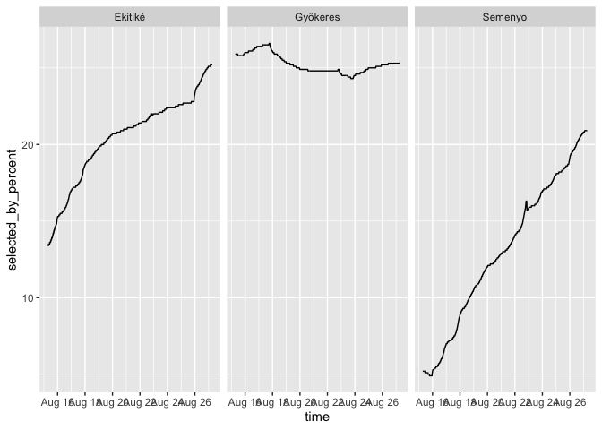

# FPL data for season 2025-26

## Datasets

1.  fplplayer_ids.csv

    - content: list of fpl player included in the sample
    - generated by: data_get_fplplayer_ids.R

2.  fpl_teams.parquet

    - content: team selections by gameweek
    - generated by: data_get_fpl_teams.R

3.  fplplayer_entry_season.parquet

    - content: points (and points on bench) and rank by gameweek
    - generated by: data_get_fplplayer_info.R

4.  fplplayer_favourite_teams.parquet

    - content: favourite teams (numeric code)
    - generated by: data_get_fplplayer_info.R

5.  fplplayer_history.parquet

    - content: past performance
    - generated by: data_get_fplplayer_info.R

6.  fplplayer_mini_leauges.parquet

    - content: mini leagues
    - generated by: data_get_fplplayer_info.R

7.  players.parquet

    - content: Premier League player prices, popularity, performance
    - generated by: data_get_players.R and data_join_players.R

## Examples

### Ownership

``` r
# Libraries
library("ggplot2")
# Load data 
df_players<-arrow::read_parquet("/Users/hhs/Dropbox/Bucket/fpl2526/data/players.parquet")

# Create chart
ggplot(df_players[df_players$web_name%in%c("Semenyo","Ekitiké","Gyökeres"),],  
      aes(x=time,y=selected_by_percent))+
    facet_wrap(~web_name)+
    geom_line()
```



### FPL player with id 6708968

#### League history

``` r
# Load data 
df_history<-arrow::read_parquet("/Users/hhs/Dropbox/Bucket/fpl2526/data/fplplayer_history.parquet")

# Check data
df_history[df_history$fplid==6708968,]
```

    # A tibble: 4 × 4
        fplid season_name total_points    rank
        <int> <chr>              <int>   <int>
    1 6708968 2020/21             1770 4747456
    2 6708968 2021/22             2084 2057795
    3 6708968 2022/23             2155 3274063
    4 6708968 2024/25             2180 3147697

#### Mini leagues

``` r
# Load data 
df_leagues<-arrow::read_parquet("/Users/hhs/Dropbox/Bucket/fpl2526/data/fplplayer_leagues.parquet")

# Check data
df_leagues[df_leagues$fplid==6708968,]
```

    # A tibble: 8 × 3
        fplid leaguename        leagueid
        <int> <chr>                <int>
    1 6708968 Wolves                  20
    2 6708968 England                261
    3 6708968 Gameweek 1             276
    4 6708968 Overall                314
    5 6708968 Sky Sports League      321
    6 6708968 Second Chance          333
    7 6708968 UTDTREY 25/26       895674
    8 6708968 AB FPL             1623392

#### Team selection

``` r
# Load data 
df_teams<-arrow::read_parquet("/Users/hhs/Dropbox/Bucket/fpl2526/data/fplplayer_teams.parquet")

# Check data
df_teams[df_teams$fpl_entry_id==6708968,]
```

        id                       playername position multiplier is_captain
    16 470                  Martin Dúbravka       12          0      FALSE
    17 502                        Matz Sels        1          1      FALSE
    18 191                    Maxime Estève       13          0      FALSE
    19 348                        Joe Rodon       15          0      FALSE
    20 370                 Jeremie Frimpong        2          1      FALSE
    21 505                Nikola Milenković        3          1      FALSE
    22 610                Aaron Wan-Bissaka        4          1      FALSE
    23 211                     Aaron Ramsey       14          0      FALSE
    24 235                      Cole Palmer        5          1      FALSE
    25 381                    Mohamed Salah        7          2       TRUE
    26 427                Tijjani Reijnders        6          1      FALSE
    27 450 Matheus Santos Carneiro da Cunha        8          1      FALSE
    28 525                       Chris Wood       10          1      FALSE
    29 654             Jørgen Strand Larsen        9          1      FALSE
    30 666                  Viktor Gyökeres       11          1      FALSE
       is_vice_captain event entry     NA. gw fpl_entry_id
    16           FALSE     1     1 6708968  1      6708968
    17           FALSE     1     1 6708968  1      6708968
    18           FALSE     2     1 6708968  1      6708968
    19           FALSE     2     1 6708968  1      6708968
    20           FALSE     2     1 6708968  1      6708968
    21           FALSE     2     1 6708968  1      6708968
    22           FALSE     2     1 6708968  1      6708968
    23           FALSE     3     1 6708968  1      6708968
    24            TRUE     3     1 6708968  1      6708968
    25           FALSE     3     1 6708968  1      6708968
    26           FALSE     3     1 6708968  1      6708968
    27           FALSE     3     1 6708968  1      6708968
    28           FALSE     4     1 6708968  1      6708968
    29           FALSE     4     1 6708968  1      6708968
    30           FALSE     4     1 6708968  1      6708968

#### Points

``` r
# Load data 
df_points<-arrow::read_parquet("/Users/hhs/Dropbox/Bucket/fpl2526/data/fplplayer_points.parquet")

# Check data
df_points[df_points$fplid==6708968,]
```

    # A tibble: 1 × 5
        fplid event points    rank points_on_bench
        <int> <int>  <int>   <int>           <int>
    1 6708968     1     53 4864965              10
